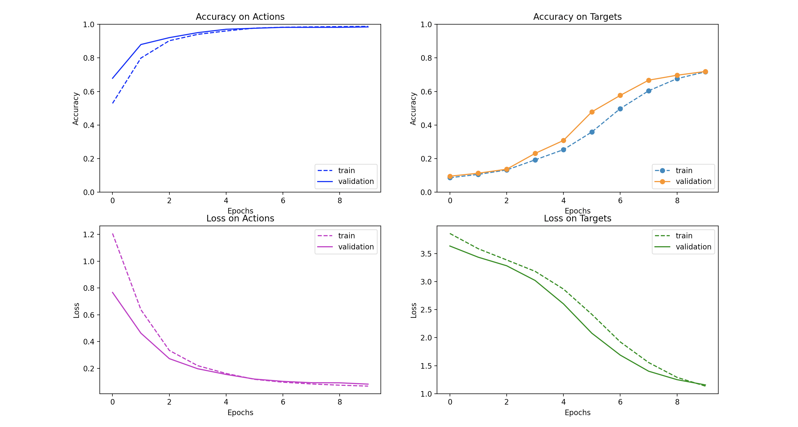
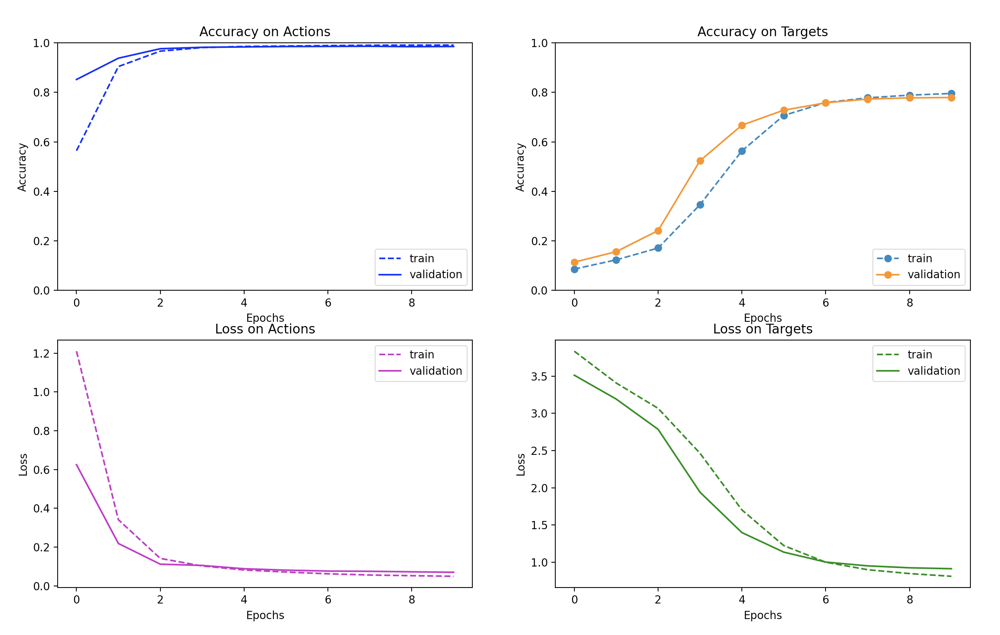
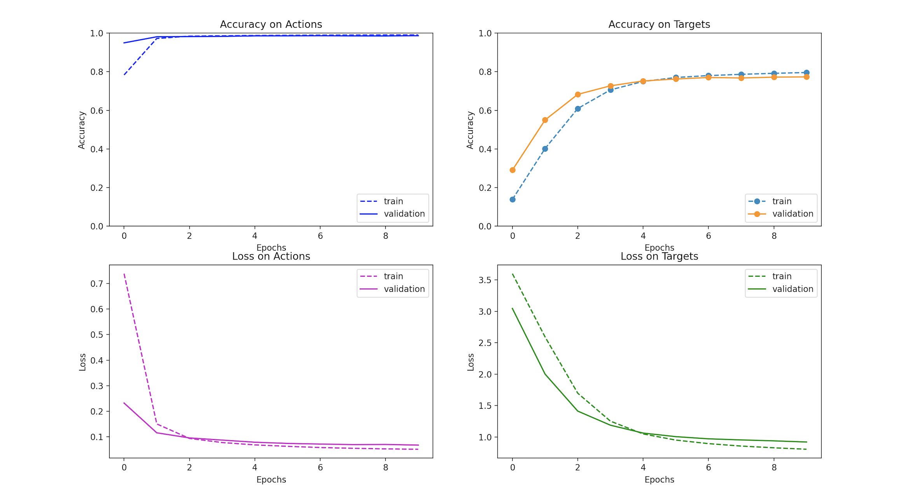
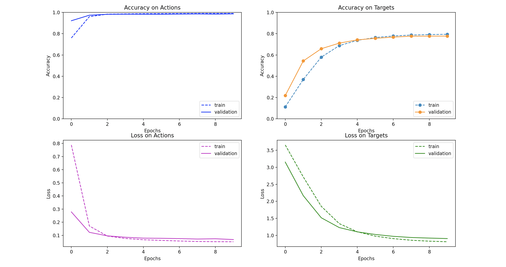

# LSTM for Text Classification

This repository implements an LSTM text classifier. Given a set of natural language instructions, the model classifies their relationship to discrete tasks in the [ALFRED](https://askforalfred.com/) environment. See the assignment below for more information about the task, data, and provided code.

To run the models described here, use ```run.sh. ```

## Tokenizers
The model begins by tokenizing the natural language instructions. It is equipped to run both word-level tokenization and byte-pair encoding. 

Byte-pair encoding meaningfully improves performance after 10 epochs, which surprised me given the nature of the task. The input distribution has relatively thin tails, with a 1000-token word-level vocabulary covering 98.7% of words in the training and validation sets. Further, the outputs are small set of discrete classes rather than the full input vocabulry, meaning BPE does not expand the range of the output. 

BPE is also notably slower than word-level tokenization. It takes about 10 minutes, compared to less than 1 minute for word-level. This is primarily driven by the step of encoding tokens after the BPE dictionary has already been built. Word-level tokenization allows a dictionary lookup of each word with time complexity of only O(1). But BPE must iterate from the longest to the shortest byte pairs, checking the string to be encoded for that pair at each step, resulting in time complexity of O(vocab_size). Better implementations of BPE would encode large batches of text inputs with a single pass through the dictionary, rather than encoding each word individually as implemented here. 

## Architecture
The model is a vanilla LSTM with the following layers:
* Embedding Layer with output dimension of 128
* LSTM with input and output dimension of 128
* Two independently trained classifier heads
    * Fully connected layer of input 128 and output 80
    * Fully connected layer of input 128 and output 8

Cross entropy is the objective function and Adam is the optimizer. Learning rate is 1e-2 for all experiments, and no other optimizer hyperparameters are utilized. 

I also tested feeding the fully-connected layers with a MaxPool of the LSTM's token-level outputs concatenated with its final hidden state. These experiments reduced the hidden state dimension to 64 so that, after concatenation, the fully-connected layer would receive the same 128 dimensions as the previous setup. This setup converged faster and improved performance after 10 epochs relative to the vanilla architecture. 

## Performance
Here is the performance chart for the vanilla model with word-level tokenization. The charts show performance for two tasks (action and target classification) and using two metrics (loss and accuracy). 


Switching to BPE improves convergence time and performance. 



Maxpool with word-level tokenization also improves convergence time and performance. 



Maxpool with BPE performs similarly well to either Maxpool or BPE individually. 



Surprisingly, these charts do not show evidence of overfitting. The model achieves consistently better performance on the validation set across epochs and architectures. 

Various tweaks that did improve performance over the course of debugging included:
* Setting the gradient of padding tokens to zero
* Lowercase for all characters prior to tokenization
* Larger batch sizes, from 100 to 20,000
* Using the Adam optimizer instead of SGD

To continue to improve performance, I would try:
* New LSTM hyperparameters such as width, depth, dropout, and bidirectional LSTMs
* Extracting semantic information from the output classes by breaking them into word pieces
* Longer training times with regularization and early stopping