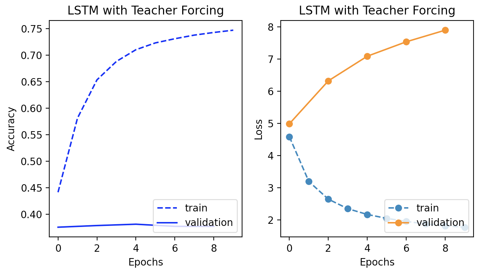
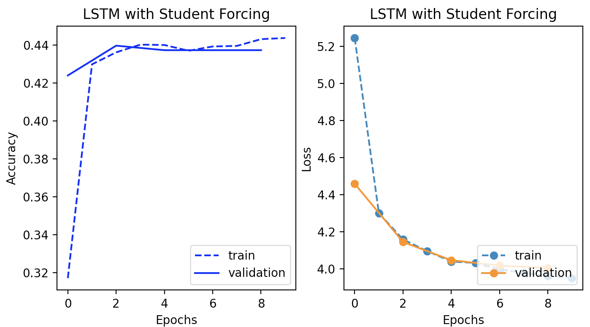
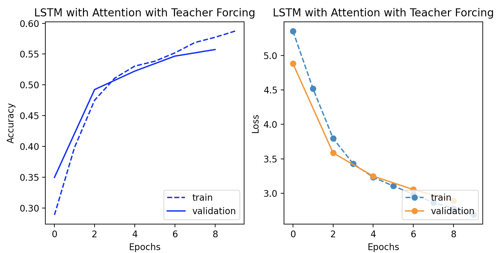
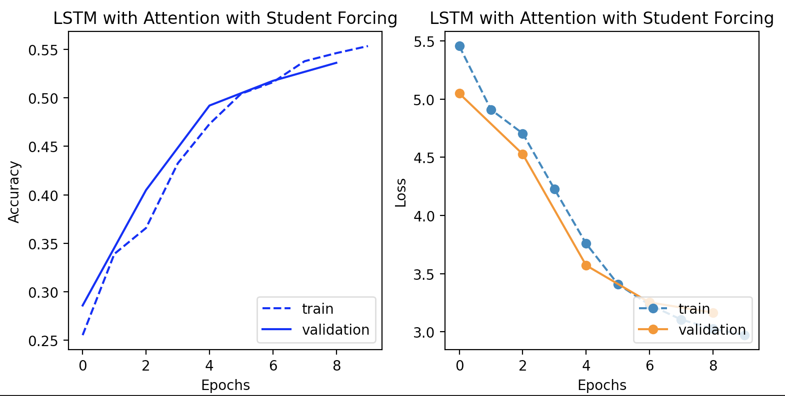
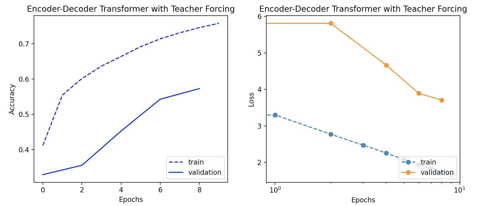
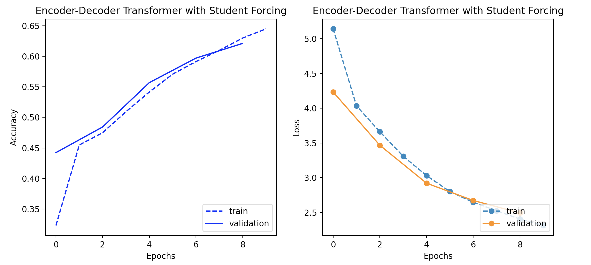

# Sequence to Sequence Encoder-Decoder Modeling
This repository implements three sequence-to-sequence encoder-decoder models: a vanilla LSTM, an LSTM with attention over the encoder's hidden state, and a Transformer. Given a set of natural language instructions, each model classifies their relationship to discrete tasks in the [ALFRED](https://askforalfred.com/) environment. See ASSIGNMENT.md below for more information about the task, data, and provided code.

# Data
The dataset consists of sequences of instructions and action-target pairs. We concatenate all instructions and apply word-level tokenization. Actions and targets are tokenized with separate vocabularies. The dataset is split into training and validation. 

# Models
All models are optimized with Adam using categorical cross entropy loss. They also use a hidden state of 16 in all applicable layers, and train for 10 epochs. Downstream evaluation also uses accuracy, which is the percentage of actions and targets which are correctly predicted, ignoring all padding tokens after the end token. 

## Vanilla LSTM
Our simplest model is a vanilla encoder-decoder LSTM. The encoder processes the instruction sequence, emitting a single hidden state vector. The decoder takes hidden state and the previously predicted token as its inputs, and generates two new hidden states as an output. One of the hidden states is used by two classifier heads to predict the action and target. The other hidden state is passed back into the LSTM for its next prediction. For this implementation, we used a hidden dimension of 16. 

## LSTM with Attention
Our second model uses the same encoder as the first, but utilizes the full sequence of encoder representations at each step via an attention mechanism. Specifically, we use soft global cross attention between the decoder LSTM's hidden state and the encoder's sequence representation. The output of this attention layer are used by the LSTM to generate its two hidden states, which inform the action-target heads and the next iteration of the LSTM decoder. We use a hidden dimensions of 16 in all layers, though the addition of the attention mechanism increases the parameter count and inference of this model. 

## Transformer
Our final model is a Transformer, implemented using only PyTorch. The encoder consists of an embedding layer, a positional embedding, and two encoder blocks. Each encoder block projects the hidden state of each token into single-headed query, key, and value vectors and computes global soft attention over those vectors. The resulting weighted average of value vectors is added to the residual input and layernormed. A two layer dense network processes this output, and applies another residual and layernorm. 

The resulting sequence of encoder hidden states is utilized by the decoder via single-headed cross attention. The decoder embeds the entire sequence of previously generated tokens, applies positional embeddings, and then runs two decoder blocks. Each decoder block applies single-headed cross attention between the decoder sequence and the encoder sequence, before applying the necessary residuals, layernorm, and dense layer. The hidden representation of the final two tokens are projected by two linear layers to predict the action and target respectively. 

## Student vs. Teacher Forcing
An important distinction for the performance of our models is student vs. teacher forcing. The typical implementation uses teacher forcing during training time, providing each generation with the gold label for previous generations so that an early misstep doesn't prevent the model from continuing to learn. Student forcing is a more difficult prediction environment where each prediction is conditioned on previous predictions, allowing errors to cascade. Our validation evaluations always use student-forcing, but we implement and evaluate models trained with both student-forcing and teacher-forcing. 

# Results

The vanilla LSTM with teacher-forcing is truly the most overfit model I've ever seen. The validation loss is nearly doubles during training, becoming far worse than the uninitialized model. I really doubted that it was possible, but I triple checked, and then laughed a lot. Gotta love ML. 

Student-forcing on the vanilla LSTM brought validation performance on par with training performance. The accuracy still wasn't great, around 44% after 10 epochs. 

Attention slowed down the LSTM, both in inference and in the slope of the loss curve. But the model eventually outperformed the vanilla LSTM, achieving 50% - 55% accuracy. Student-forcing had a much smaller effect than in the vanilla LSTM. 

The Transformers performed the best, which was a nice payoff for the effort. The teacher-forced model achieved strong training accuracy (74%) at the expense of lower validation accuracy (58%). The student-forced Transformer was the best performing model, achieving 64% training accuracy and 62% validation accuracy. 
